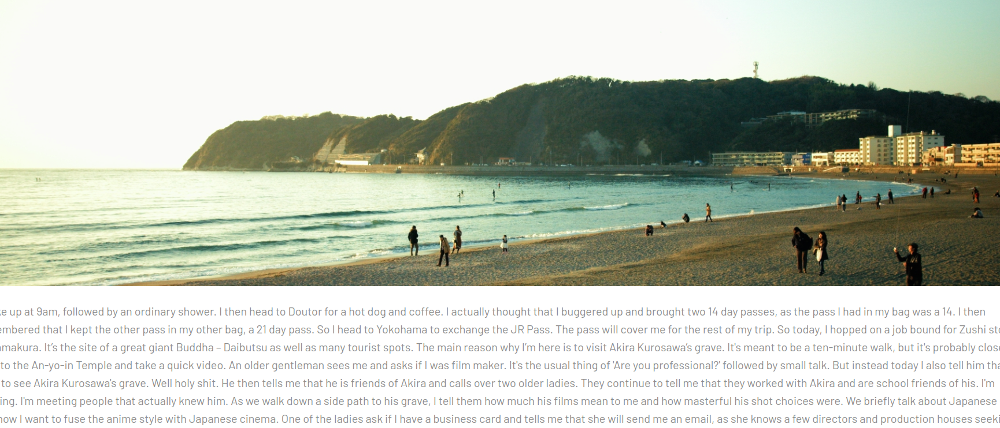

# See Nippon!

See Nippon! is a project created by Emma Bindi, Lanzhou Jiang and Danny Field as part of a 3 day 'hackathon' at Coder Academy.

# Front End

Javascript and React

# Back End

Ruby on Rails and Postgresql database

# Theme

A blogging site that allowed users to sign in and post blogs about their trip to Japan. The main idea was for travellers to post tips about their trip over there. Tips such as having a JR Pass, or buying a SIM card prior to departing are some examples.

# Screenshots

